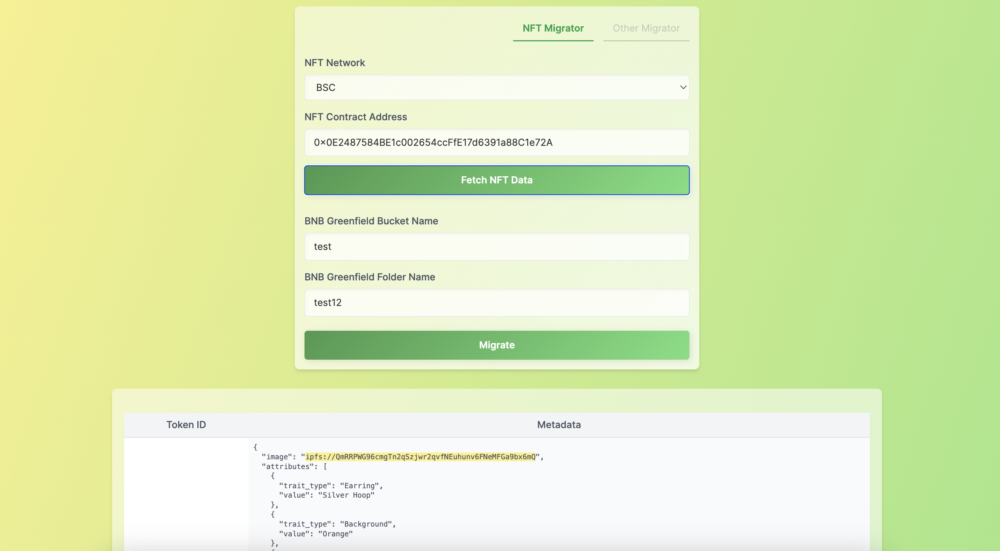
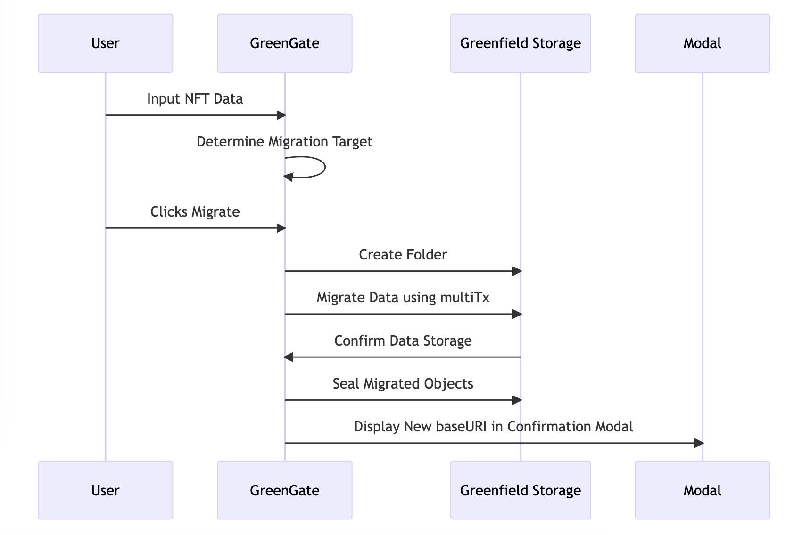
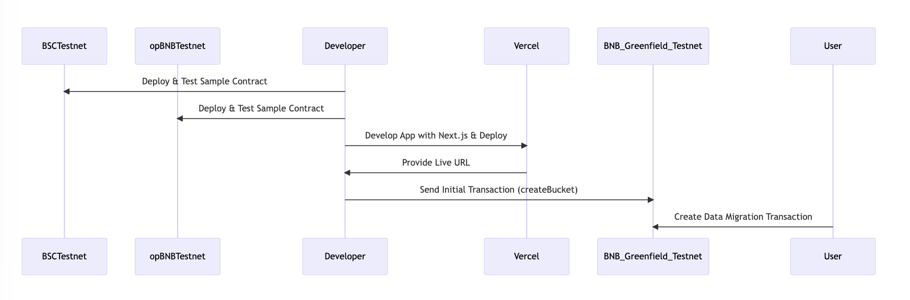

# GreenGate

## Live App

https://greengate.vercel.app/

## Pitch Deck

https://docs.google.com/presentation/d/14emSiZJE9Odl98qmHjbZBNj6xcQkn6g_553p-cB0Wok/edit?usp=sharing

## Demo Video

Coming soon!

## Description

GreenGate is a data migration service designed primarily to transition data to the BNB Greenfield storage system. Our first tool facilitates the migration of NFT data from IPFS to Greenfield.

## Problem and Solution

### The Challenge:

Migrating data between storage providers, especially to Greenfield, can be time-consuming. Typically, it involves a two-step process: downloading data from the original storage and then re-uploading it to the new one.

### GreenGate's Answer:

GreenGate simplifies the data migration process. Our automated system downloads data from the source and uploads it directly to Greenfield in a single transaction. This approach makes data migration more efficient and reduces manual intervention.

## Benefit

**GreenGate offers unique advantages:**

**Automated Process:** GreenGate simplifies migration by automatically transferring data, such as NFTs from IPFS. This reduces errors and speeds up the entire process.

**MultiTx Processing:** Instead of the slower linear approach, GreenGate ensures faster, integrated migration by using bundled transfers for multiple transactions.

By leveraging these capabilities, GreenGate provides users a more efficient and seamless migration experience tailored for blockchain ecosystems.

## Workflow

**Greenfield Chain JS SDK:** GreenGate operates using the Greenfield Chain JS SDK version 2.4.0. We ensure compatibility and support for the chain update released on August 31st.

**Automatic Target Migration:** Upon user input of NFT data, GreenGate intelligently determines the appropriate migration target.

**Folder Creation and Data Storage:** Initiating the migration will automatically create a designated folder in Greenfield storage. Data migration is accomplished using multiTx, ensuring an efficient and orderly transfer process.

**Object Sealing:** As an added layer of data integrity and security, all migrated objects are sealed during the migration process.

**Confirmation and Display:** Once the data migration is successful, users are presented with a confirmation modal. This modal displays the new baseURI for the migrated data, confirming its new location in Greenfield storage.

## Deployment Pipeline

### Reference

#### Create Object Tx

https://greenfieldscan.com/tx/0xe429ea855370efb451e55560fb02c4e619e1c8f8d1089513ab4802092772c210

#### Migrated metadata

https://gnfd-testnet-sp2.nodereal.io/view/test/test12/0

#### Sample NFT

##### opBNB Testnet

https://opbnbscan.com/address/0x0E2487584BE1c002654ccFfE17d6391a88C1e72A

##### BSC Testnet

https://testnet.bscscan.com/address/0x0E2487584BE1c002654ccFfE17d6391a88C1e72A

## Roadmap

Our initial release supports NFT data migration from IPFS to Greenfield. However, we have plans to introduce tools for other data sources soon. The goal is to make GreenGate a comprehensive solution for all data migration needs to Greenfield storage.

## Disclaimer

- GreenGate currently supports only NFTs that utilize the ERC721Enumerable standard and are deployed on the BSCTestnet or opBNBTestnet.
- The process of creating an object in Greenfield Storage is resource-intensive. To demonstrate the migration more efficiently, only one record is migrated at a time.
